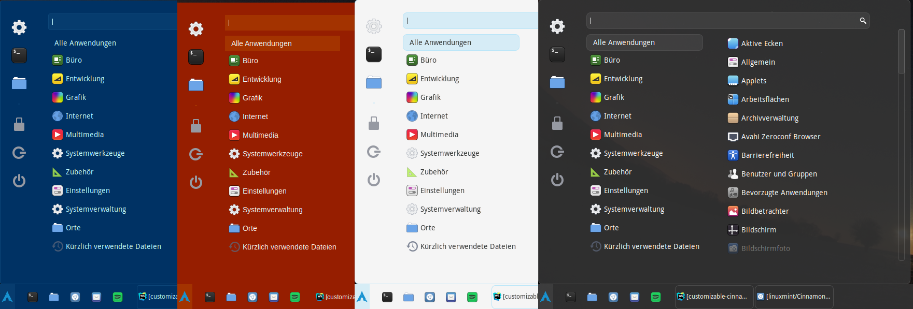

# Customizable Cinnamon Theme



This theme for the Cinnamon Desktop Environment can be customized via SASS variables. It is based on the default theme with a few modifications:

*   Flat colors instead of gradients
*   Higher panel
*   No shadows


## Getting Started

1. Clone this repository

2. Install dependencies

```sh
npm install
```

3. Create a symlink to this theme in *~/.themes* (the .themes folder has to exist in the home directory of the current user!)

```sh
npm run link
```

4. Compile the SASS to CSS

```sh
npm run build
```

5: (Re)load the theme in Cinnamon

```sh
npm run reload
```

## Customizing

### Changing colors, borders and fonts

The default values for colors, borders and fonts are configured in `sass/base/variables.scss`.

You can override these values with your own in `sass/custom-variables.scss`.

### Main variables

Basics

*   $base-color: Used for backgrounds
*   $base-accent-color: Used for borders and hover overlays
*   $base-accent-strength: Opacity for accents (0-1)

Fonts

*   $font-family
*   $font-size
*   $font-size-large
*   $font-size-small

Colors (default values depend on $base... variables)

*   $color-text
*   $color-background
*   $color-border
*   $color-hover
*   $color-active
*   $color-separator
*   $color-disabled
*   $color-highlight

Borders

*   $border-radius
*   $border-width
*   $border: Complete border definition

Other

*   $transition-duration

The variables for different applets and components usually inherit the values from the base variables. Only override them if you want them to be different from the base value.


### Changing the base theme

This theme is based on the default Cinnamon theme, but you can use a different base theme instead.

Replace the contents of `sass/base/original-theme.scss` with those of `cinnamon.css` from the base theme you want to use. 

> **Note:** Paths to assets have to be relative to the `cinnamon` directory!

If you want to switch to the base theme completely for certain components or applets, just remove the relevant `@import` statement from the main `cinnamon.scss` file.

### Adding custom rules

Custom rules can be added in the file `sass/custom-rules.scss`.


## Tips & Tricks

For continuous development, the following command automatically builds and reloads the theme when files have been changed:

```sh
npm run watch
```

## Examples

### Ubuntu

```scss
$base-color: #5E2750;
$base-accent-color: #E95420;
$base-accent-strength: 0.4;
$font-family: Ubuntu;
$border-width: 0px;
```

### Windows 10

```scss
$base-color: #000;
$base-accent-strength: 0.4;
$border-radius: 0px;
$border-width: 0px;
```

## Credits

*   Default Cinnamon theme from [linuxmint/Cinnamon](https://github.com/linuxmint/Cinnamon)
*   Inspiration and snippets from [zagortenay333/zukitwo-cinnamon](https://github.com/zagortenay333/zukitwo-cinnamon)
